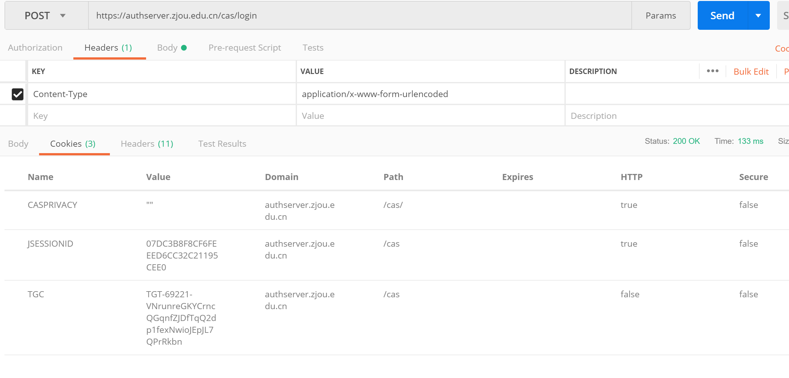
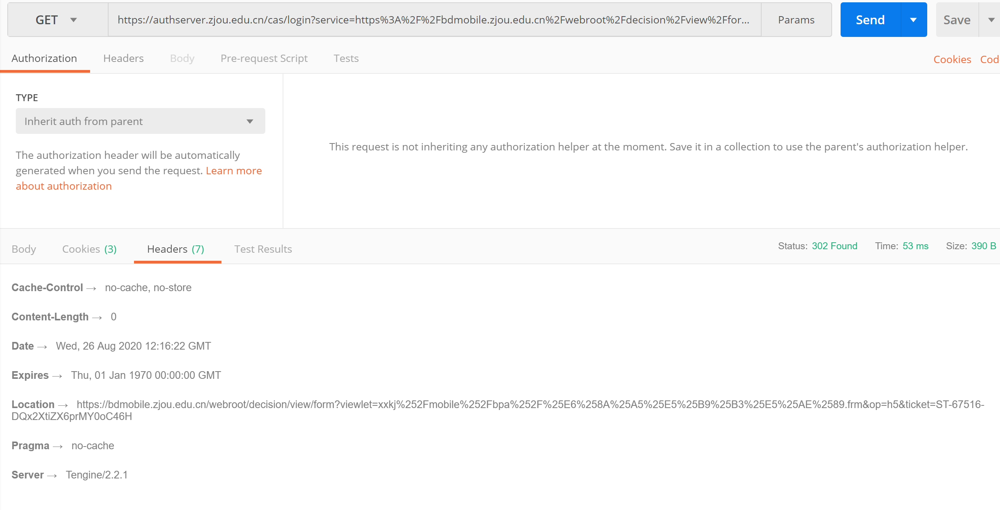
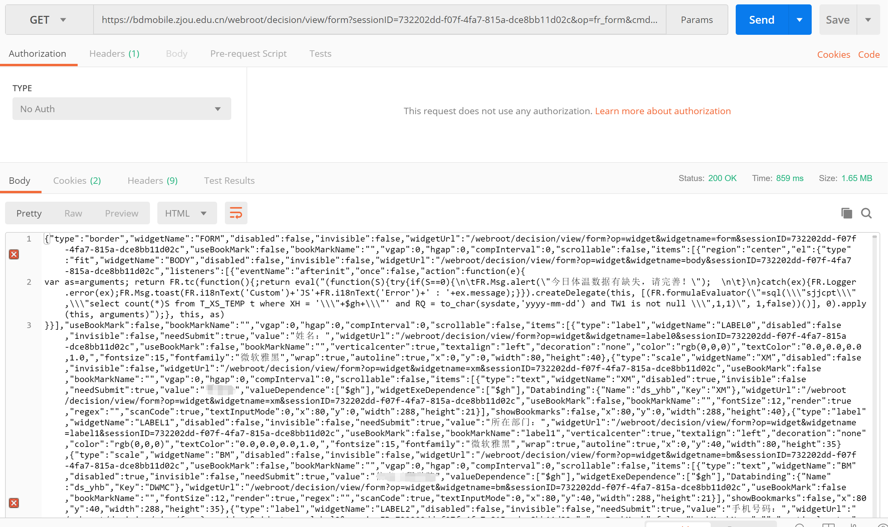

# AutoClockInV2

自动打卡第二版

开学后学校启用了新版的钉钉打卡，名曰“钉钉打卡”，其实只是通过钉钉的APP绑定校园卡账户，使用钉钉账号自动登录，服务端还是学校自己建的，而且校园卡账户的登录入口依然可用。既然如此，那我直接模拟登录校园卡账户即可。和之前稍有不同的是，这次的服务端使用了认证中心，所有的请求会先跳到认证中心认证，如果已登录，也就是带有 Cookie，那么认证中心会在请求参数中添加 ticket, 并302到最开始请求的地址，如果没登录就跳转到登录界面，登录完成后再添加 ticket 跳回最初请求的地址。除此之外打卡时提交的数据格式也和之前完全不同（忍不住吐槽一下，填表界面的数据居然传了一个巨大的 json，巨大到什么程度呢，里面包含了中国所有的省市县，而且出现了不止一次！）。

登录完成，拿到认证中心的Cookie

访问打卡页面会跳到认证中心，带上 Cookie， 认证中心发放 ticket

打卡填表页面，接收一个巨大的 json （注意看大小，1.65MB。。。）

最后，希望早日解封
